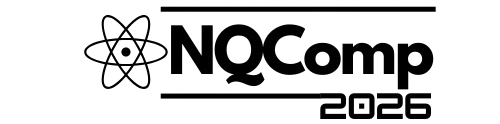

# NQComp 2027 — 2nd International IEEE Conference Website

<p align="center">
  
</p>

Official website for the **2nd International Conference on Next-Gen Quantum and Advanced Computing: Algorithms, Security, and Beyond (NQComp 2027)**, an IEEE conference organized by the **School of Computer Engineering, MIT Bengaluru, MAHE**.

📅 **Conference Dates:** January 21–23, 2027  
📍 **Venue:** Manipal Institute of Technology, Bengaluru

---

## 🌐 Pages

| Page | File | Description |
|------|------|-------------|
| Home | `index.html` | Landing page with hero, about section, important dates |
| Call for Paper | `HTML/CallForPaper.html` | Paper tracks, submission guidelines |
| Paper Submission | `HTML/paper_submission.html` | CMT submission link and instructions |
| Registration | `HTML/Registration.html` | Fee tables (early bird & regular), payment link, hotel info |
| Organizing Committee | `HTML/Organizing_Committee.html` | Full committee listing (Chief Patron through Website Committee) |
| Advisory Committee | `HTML/Advisory_Committee.html` | Advisory board members |
| Technical Program Committee | `HTML/Technical_Program_Committee.html` | TPC members |
| Pre-Conference Workshop | `HTML/PreConferenceWorkshop.html` | Workshop on Quantum Technologies |
| Best Paper Awards | `HTML/BestPaperAward.html` | Best paper award winners |

---

## 📅 Important Dates

| Milestone | Date |
|-----------|------|
| Call for Papers | July 15, 2026 |
| Paper Submission Deadline | September 30, 2026 |
| Final Notification | November 15, 2026 |
| Camera Ready Submission | December 1, 2026 |
| Early Bird Registration | November 25–30, 2026 |
| Regular Registration | December 1–7, 2026 |
| Conference | January 21–23, 2027 |

---

## 🛠 Tech Stack

- **HTML5** — Structure
- **CSS3** — Custom styling (see `CSS/README.md` for file guide)
- **Bootstrap 4.3** — Grid and components
- **Font Awesome 4.7** — Social icons
- **Animate.css** — CSS animations

---

## 📁 Project Structure

```
├── index.html                          # Home page
├── CSS/
│   ├── README.md                       # CSS file guide for contributors
│   ├── global.css                      # Shared: nav, footer, icons, buttons, reset
│   ├── homepage.css                    # Home page: hero, dates, about, sponsors
│   ├── call-for-paper.css              # Call for Paper: track cards
│   ├── paper-submission.css            # Paper Submission: manuscript sections
│   ├── registration.css                # Registration: fee tables, hotel cards
│   ├── organizing-committee.css        # Organizing Committee: member lists
│   ├── advisory.css                    # Advisory Committee: advisory lists
│   ├── technical-program.css           # TPC: member list
│   └── pre-conference-workshop.css     # Workshop: details, brochure
├── HTML/
│   ├── Advisory_Committee.html
│   ├── BestPaperAward.html
│   ├── BestPaperAwards.html
│   ├── CallForPaper.html
│   ├── Organizing_Committee.html
│   ├── PreConferenceWorkshop.html
│   ├── Registration.html
│   ├── Technical_Program_Committee.html
│   └── paper_submission.html
├── Photo/                              # Images and logos
└── public/                             # PDFs (sponsorship flyer, workshop brochure)
```

---

## 🚀 How to Run

Open `index.html` in any browser. No build step required.

---

## 📝 Changelog

### v5 — July 2026

- Updated title to **NQComp 2027**
- Changed conference dates to **January 21–23, 2027**
- Updated all **Important Dates** to the new 2026-2027 schedule
- Replaced logo with inverted black version
- Fixed responsive layout and text wrapping of date cards on the homepage

### v4 — May 14, 2026

**Security Hardening**
- Fixed **mailto phishing** — all `mailto:` links now point to `nqcompmit@gmail.com` (were incorrectly pointing to defunct `schas.conference@gmail.com`)
- Added **`rel="noopener noreferrer"`** to all `target="_blank"` links (social media, hotels, IEEE template) to prevent reverse tabnabbing
- Added **SRI integrity hashes** to Font Awesome CDN and all jQuery/Popper/Bootstrap scripts
- Fixed **paper_submission.html** using mismatched CDN versions (jQuery 3.6.0 → 3.3.1, Popper 1.16 → 1.14.7)
- Updated **`og:url`** meta tag from stale `schas2025` to `nqcomp2026`
- Fixed all stale **alt text** from "SCHAS 2025" / "NQComp 2025" → "NQComp 2026"
- Removed leftover **debug comments** and unreachable code

**CSS Reorganization**
- Renamed all 9 CSS files to **consistent kebab-case** naming (e.g., `Committee.css` → `global.css`, `Land.css` → `homepage.css`, `Paper_Submitt.css` → `paper-submission.css`)
- Removed **massive code duplication** — duplicate `.hero1` block, triple `body {}` declarations, 6 redundant resets
- Removed **~30 lines of dead commented-out code** (arrow styles, nav overrides)
- Added **file headers** and section markers to every CSS file
- Added **`CSS/README.md`** — file structure guide for contributors
- Scoped page-specific `body` font overrides to **content containers only**, so nav font stays consistent

**Responsive Improvements**
- Added **3-tier responsive breakpoints** to global nav (1200px tablet, 1067px hamburger, 480px phone)
- Added **slide-down animation** on hamburger menu open
- Added **footer vertical stacking** on phones
- Added **phone breakpoints** to 5 pages that had none (Advisory, TPC, Paper Submission, Workshop, Organizing Committee)
- Added **horizontal scroll** for registration tables on mobile
- **Disabled hover animations** on touch devices (unusable on mobile)

**Content Updates**
- Updated **Patrons**: replaced Lt. Gen. (Dr.) M. D. Venkatesh → Dr. Sharath. K. Rao (VC, MAHE)
- Updated **General Chairs** titles: Dr. Megha → "Professor & Associate Dean, SoCE", Dr. Shaleen → "SoCE"
- Added **MIT Bengaluru** affiliation to 3 Publication Committee members
- Updated **Website Committee** academic year from 1st → 2nd year BTech

### v3 — May 9, 2026

- Removed **IEEE Bangalore Section** logo from Technical Co-Sponsors
- **TPC restructured**: removed 6 names, added 5 new members at top (Prasant Misra, Dr. Chengappa M R, Dr. Sumana M, Dr. Lakshmana, Dr. Piyush Kumar Pareek)
- Updated **Dr. Vijay Kumar B P** affiliation to IEEE CIS, Bangalore Section in Advisory Committee
- Added **Dr. Manjunath R Kounte** to Publication Committee
- Updated **Important Dates**: Final Notification → Oct 31, Camera Ready → Nov 15, Early Bird → Nov 01–08, Regular → Nov 09–15
- Removed **Paper Submission CMT link**
- Removed **Payment Link** and **CMT Link** from Registration
- Removed **Honorary Chairs** section (names moved to TPC)
- Updated Review Process to **double-blind peer review**
- Removed **Pre-Conference Workshop** from navigation
- **Organizing Committee**: replaced 30 members with 10 new members
- **Merged Conference Chair** section into General Chairs

### v2 — May 2026

- Updated title to **2nd International Conference**
- Changed conference dates to **December 9–11, 2026**
- Updated IEEE Xplore text to **(To be approved)**
- Updated all **Important Dates** to new schedule
- Replaced IEEE Computer Society logo with **IEEE CIS Bangalore Chapter** logo in Technical Co-Sponsors
- Removed **QuantrolOx** sponsor section
- Updated **Honorary Chairs**: Prasant Misra & Dr. Chengappa M R
- Added **Dr. Sumana. M** to Technical Program Committee
- Removed **Updates** dropdown from navigation across all pages

---

### Created by

- Ameya Mhatre
- Rushil Bakori
- Aditya Jemshetty
